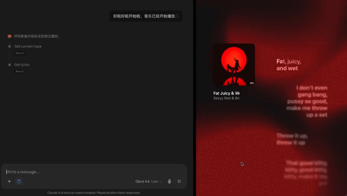

# 🎵 Apple Music MCP

An [MCP (Model Context Protocol)](https://modelcontextprotocol.io) server that lets AI assistants control **Apple Music** on macOS — play, pause, skip, read lyrics, manage playlists, and search the catalog.

Built for [Claude Desktop](https://claude.ai/download) and [Claude Code](https://docs.anthropic.com/en/docs/agents-and-tools/claude-code/overview). Works with any MCP-compatible client.

<p align="center">
  
</p>

## What It Does

| Tool | Description |
|------|-------------|
| `get_current_track` | Now playing info — title, artist, album, progress |
| `get_lyrics` | Time-synced lyrics via LRCLIB → NetEase Cloud Music fallback |
| `control_playback` | Play, pause, toggle, next, previous, stop |
| `create_playlist` | Create a new playlist |
| `add_to_playlist` | Add the current track to a playlist (works with subscription tracks) |
| `list_playlists` | List all user playlists |
| `search_tracks` | Search library + Apple Music catalog |
| `search_and_add` | Find a track and add it to a playlist in one call |

## How It Works

The server bridges your AI assistant to Apple Music through three layers:

**AppleScript → Music.app** — All playback control and playlist operations go through macOS's native AppleScript interface. The server sends commands to Music.app directly — no Apple Music API keys, no web auth, no token management. If Music.app can do it, this server can do it.

**Lyrics: LRCLIB → NetEase fallback** — When your AI asks for lyrics, the server tries [LRCLIB](https://lrclib.net) first (strong English coverage), then falls back to [NetEase Cloud Music](https://music.163.com) for Chinese and Asian-language songs. Both are free, no API keys required. Results are time-synced and returned with the current playback position so your AI knows which line is playing now.

**Architecture** — The design was informed by [netease-music-mcp](https://github.com/luuu-h/netease-music-mcp)'s approach to lyrics retrieval. We extended it with Apple Music's native AppleScript integration and a dual-source lyrics fallback for broader language coverage.

## Requirements

- **macOS** (uses AppleScript under the hood)
- **Python 3.10+**
- **Apple Music** with an active subscription or local library
- **curl** (bundled with macOS)

## Installation

```bash
git clone https://github.com/yauyuuue-commits/apple-music-mcp.git
cd apple-music-mcp
python3 -m venv .venv
source .venv/bin/activate
pip install -e .
```

## Setup

### Claude Desktop

Add to your `claude_desktop_config.json`:

```json
{
  "mcpServers": {
    "apple-music": {
      "command": "/ABSOLUTE/PATH/TO/apple-music-mcp/.venv/bin/python",
      "args": ["-m", "apple_music_mcp"]
    }
  }
}
```

> ⚠️ Replace `/ABSOLUTE/PATH/TO/` with the actual path where you cloned the repo.

### Claude Code

```bash
claude mcp add apple-music -- /ABSOLUTE/PATH/TO/apple-music-mcp/.venv/bin/python -m apple_music_mcp
```

### Quick Test

After setup, open a new Claude conversation and say **"what song is playing?"** — if Claude returns track info from Apple Music, you're good to go.

## Lyrics

The `get_lyrics` tool fetches time-synced lyrics with a two-tier fallback:

1. **[LRCLIB](https://lrclib.net)** — community lyrics database, good English coverage
2. **[NetEase Cloud Music](https://music.163.com)** — fills gaps for Chinese and other Asian-language songs

No API keys needed. Coverage varies — some songs won't have synced lyrics on either source.

## Card Display (Optional & Customizable)

This MCP gives your AI the raw tools. What it *does* with them is up to you.

For example, we built a Tinder-style swipe card UI for music discovery — Claude listens to each song, reads the lyrics, decides if it likes it, and shows an animated card that swipes right (save) or left (skip). See the [demo above](#) for what this looks like in action.

The card display is not part of this MCP server. It lives in the AI's conversation as a prompt-driven behavior. If you want something similar, **design it together with your Claude** — that's half the fun. The data structure is simple: song title, artist, a lyrics snippet, and a verdict. The visual style is yours to create.

## Known Limitations

- **macOS only** — AppleScript doesn't exist on Windows or Linux
- **Subscription tracks** — `add_to_playlist` works with subscription tracks by copying them to your library first, but there's a brief delay (~4s)
- **Library-only search for `search_and_add`** — if a track isn't in your library, it returns the catalog match but can't add it directly. Play it first, then use `add_to_playlist`
- **Lyrics coverage** — LRCLIB + NetEase covers most popular songs, but niche or very new tracks may not have synced lyrics available

## Project Structure

```
apple-music-mcp/
├── README.md
├── LICENSE
├── pyproject.toml
└── src/
    └── apple_music_mcp/
        ├── __init__.py
        ├── __main__.py
        └── server.py      ← all 8 tools live here
```

## Acknowledgments

Lyrics integration inspired by [luuu h's netease-music-mcp](https://github.com/luuu-h/netease-music-mcp) — the NetEase fallback approach for Chinese lyrics coverage came from studying that project.

## License

MIT — see [LICENSE](LICENSE).

